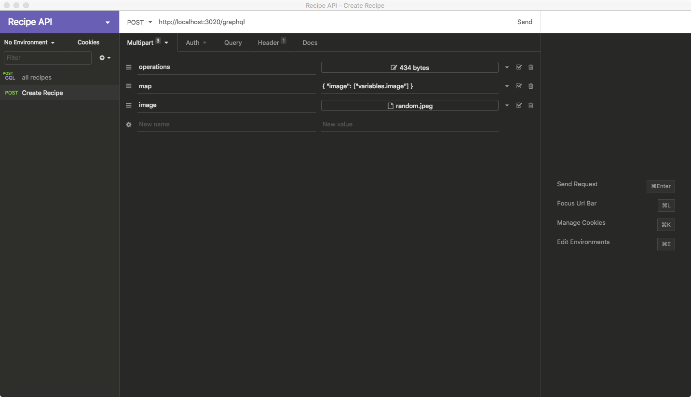

# Simple Recipe API

A simple recipe api that exposes a graphql endpoint with CRUD features. The project uses Apollo GraphQL server with Node, Express, Mongoose and MongoDB.

## Getting Started

These instructions will get you a copy of the project up and running on your local machine for development and testing purposes.

### Prerequisites

Node.js and MongoDB are required for this project to run. To install Node.js, download the appropriate package for your OS [here](https://nodejs.org/en/download/). Follow instructions to install MongoDB [here](https://docs.mongodb.com/manual/installation/).

### Installing

First clone this repository by running:

```bash
git clone https://github.com/ahmedfaaid/Simple-Recipe-API.git
```

Then install all the necessary dependencies by running:

```bash
npm install
```

Run the server using:

```bash
npm start
```

Open the GraphQL playground at http://localhost:3020/graphql

Create your first recipe

```graphql
mutation {
  createRecipe(
    recipe: {
      name: "Recipe name..."
      cuisine: "Origin of food..."
      description: "Delicious meal"
      category: "Main dish"
      ingredients: "Many ingredients..."
    },
    image: {...}
  ) {
    _id
    name
    cuisine
    description
    category
    ingredients
    image {
      _id
      filename
      path
      mimetype
    }
  }
}
```

The best way to run the createRecipe mutation is either using [Apollo Client](https://www.apollographql.com/docs/react/) and [Apollo Upload Client](https://github.com/jaydenseric/apollo-upload-client#readme) or using [Postman](https://www.postman.com/)/[Insomnia](https://insomnia.rest/) with the example below



Operations json should look like:

```json
{
  "query": "mutation CreateRecipe($recipe: RecipeInput!, $image: Upload!) { createRecipe(recipe: $recipe, image: $image) { _id name cuisine description category ingredients image { _id filename path mimetype } } }",
  "variables": {
    "recipe": {
      "name": "Recipe name ...",
      "cuisine": "Origin ...",
      "description": "Recipe description ...",
      "category": "Category ...",
      "ingredients": "Some ingredients"
    },
    "image": null
  },
  "operationName": "CreateRecipe"
}
```

Query all recipes

```graphql
query {
  getRecipes {
    _id
    name
    ingredients
  }
}
```

Query one recipe

```graphql
query {
  getRecipe(id: "...") {
    _id
    name
    ingredients
  }
}
```

Other graphql operations available in the schema document.

## Built With

- [Apollo Server Express](https://www.apollographql.com/docs/apollo-server/integrations/middleware/) - GraphQL server
- [Mongoose](https://mongoosejs.com/) - ODM Library
- [MongoDB](https://www.mongodb.com/) - No-SQL Database

## License

This project is licensed under the MIT License - see the [LICENSE.md](LICENSE.md) file for details
